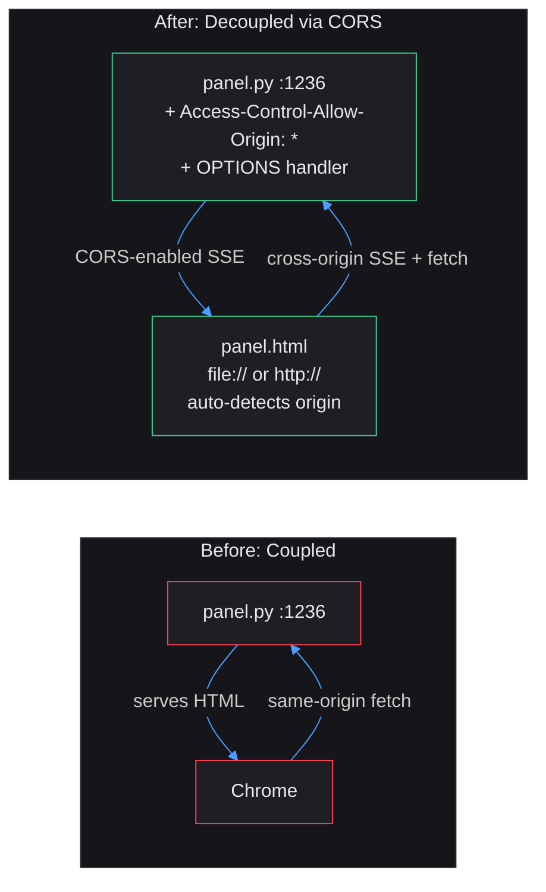
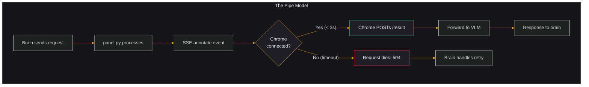
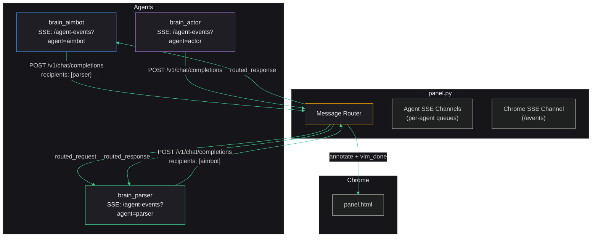
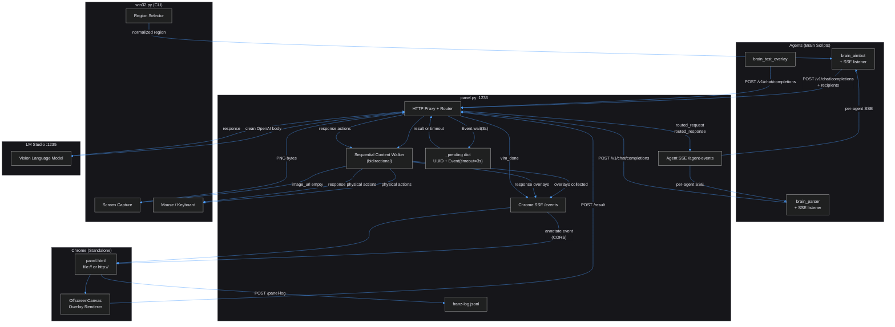
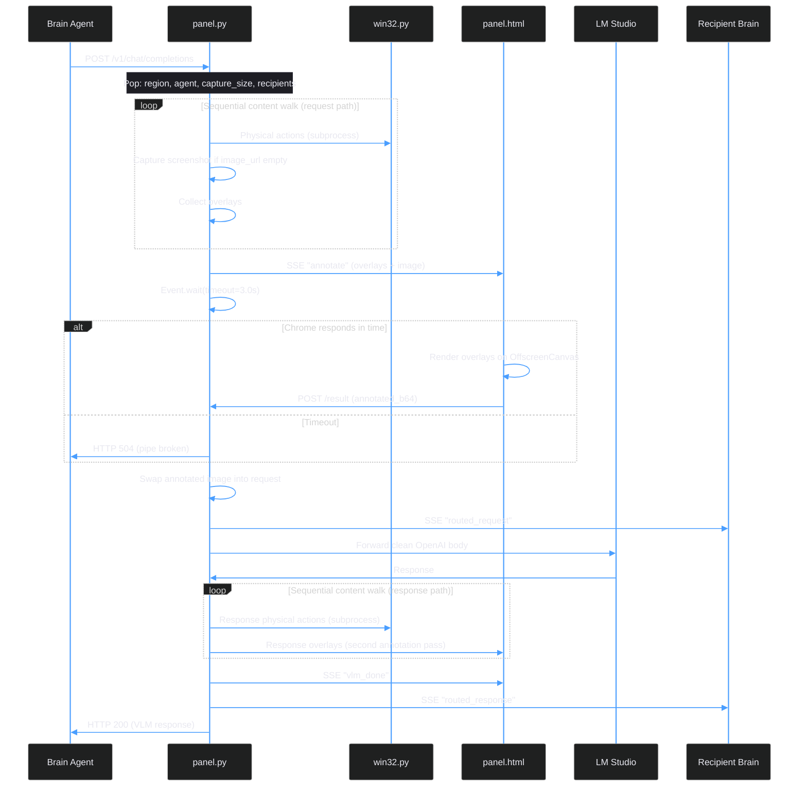
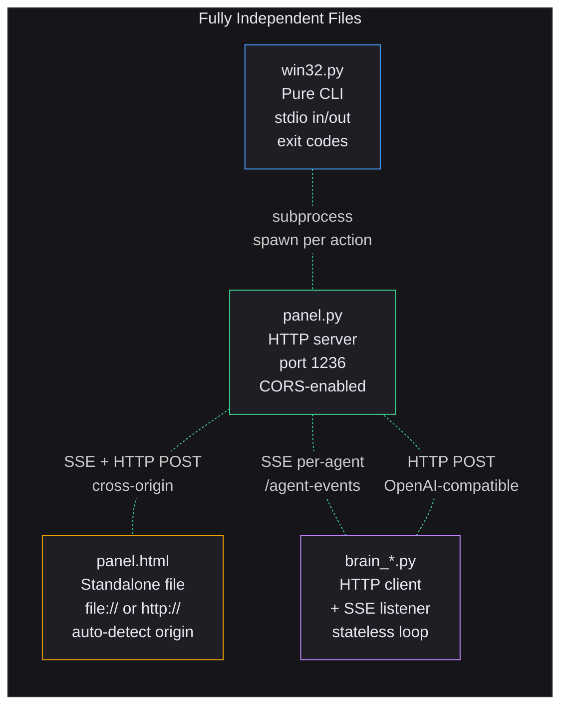

```markdown
# Franz Swarm

Autonomous computer-control agent system for Windows 11. Pure Python 3.13, stdlib only, zero pip dependencies.

Franz Swarm connects AI vision models to physical desktop automation through a fully decoupled pipeline architecture. Every component is an independent process communicating over HTTP and SSE. Agents send requests through a local proxy server. A standalone Chrome-based annotation layer renders visual overlays. Actions execute bidirectionally from both requests and responses. Agents route messages to each other through SSE channels. Start any component in any order, kill any one at any time, bring it back. The pipeline resumes.

## Design History: From Coupled Server to Autonomous Swarm Plumbing

This architecture emerged through a single design session with a clear trajectory: transform a monolithic proxy into a minimal, foolproof pipe system capable of supporting a self-organizing agent swarm.

### Phase 1: Identifying the Coupling Problem

The original system served `panel.html` from `panel.py`. Chrome had to be opened at `http://127.0.0.1:1236/`. The annotation pipeline blocked indefinitely on `threading.Event.wait()` with no timeout. If Chrome was not open, the entire system hung forever.

**Problem**: Two components pretending to be one. The HTML was a UI layer forced into a server dependency. No graceful degradation. No independence.

### Phase 2: CORS Decoupling



**Solution**: Added `Access-Control-Allow-Origin: *` to every response in `panel.py` and a `do_OPTIONS` preflight handler. Changed `panel.html` to auto-detect `file://` vs `http://` protocol and prefix all endpoint URLs with the absolute panel origin when opened as a local file.

**Result**: `panel.html` became a standalone file. Double-click it in Windows Explorer and it connects to `panel.py` via CORS. Reload it, close it, reopen it. Each time it connects fresh with no memory of the past. The EventSource API auto-reconnects when `panel.py` restarts.

**Cost**: 12 new lines in `panel.py`, 6 modified lines in `panel.html`.

### Phase 3: Timeout-Guarded Pipe



**Key decision**: When Chrome is absent, the request dies. No fallback. No raw image substitution. No silent degradation. The pipe is broken and the brain knows it (504 error). This is a safety feature for an autonomous swarm: closing the browser tab instantly halts all VLM communication. Reopening it restores operation.

**Implementation**: `threading.Event.wait(timeout=CFG.annotate_timeout)` replaces the infinite `wait()`. Configurable via `_Config.annotate_timeout` (default 3.0 seconds).

### Phase 4: Bidirectional Action Processing

```mermaid
%%{init:{'theme':'dark','themeVariables':{'primaryColor':'#1e1e24','primaryTextColor':'#e8e8f0','primaryBorderColor':'#c084fc','lineColor':'#c084fc','secondaryColor':'#16161a','tertiaryColor':'#0d0d0f','edgeLabelBackground':'#16161a','clusterBkg':'#16161a','clusterBorder':'#2a2a35','titleColor':'#e8e8f0','nodeTextColor':'#e8e8f0'}}}%%
graph LR
    subgraph REQUEST_PATH["Request Path (Brain to VLM)"]
        direction LR
        R1["image_url empty?<br/>Capture screenshot"] --> R2["actions block?<br/>Execute + strip"]
        R2 --> R3["Annotate via Chrome<br/>(overlays on image)"]
        R3 --> R4["Forward to VLM"]
    end

    subgraph RESPONSE_PATH["Response Path (VLM to Brain)"]
        direction LR
        V1["VLM responds"] --> V2["actions in response?<br/>Execute + strip"]
        V2 --> V3["Response overlays?<br/>Second Chrome annotation"]
        V3 --> V4["Return to brain"]
    end

    REQUEST_PATH --> RESPONSE_PATH

    style R1 fill:#1e1e24,stroke:#4a9eff,color:#e8e8f0
    style R2 fill:#1e1e24,stroke:#4a9eff,color:#e8e8f0
    style R3 fill:#1e1e24,stroke:#4a9eff,color:#e8e8f0
    style R4 fill:#1e1e24,stroke:#4a9eff,color:#e8e8f0
    style V1 fill:#1e1e24,stroke:#c084fc,color:#e8e8f0
    style V2 fill:#1e1e24,stroke:#c084fc,color:#e8e8f0
    style V3 fill:#1e1e24,stroke:#c084fc,color:#e8e8f0
    style V4 fill:#1e1e24,stroke:#c084fc,color:#e8e8f0
```



**Insight**: Actions and overlays are the same thing. Both are instructions the pipe executes when it encounters them. The pipe does not care which direction they flow. A brain can send overlays in its request (pre-VLM annotations for context). A VLM can return actions in its response (mouse clicks, keyboard input, new overlays). The same JSON format, the same processing logic, both directions.

**Content processing is sequential**. The order of parts in the JSON content array determines execution order. Screenshot capture before click, or click before screenshot. The brain (or VLM) controls the sequence by arranging the content parts.

### Phase 5: Multi-Agent SSE Routing



**Mechanism**: Each brain opens an SSE connection to `/agent-events?agent=NAME`. When a request includes a `recipients` field listing agent names, `panel.py` pushes copies of both the request context and the VLM response to those agents via their SSE channels.

**Emergent behavior**: Agents recruit each other dynamically at runtime. No hardcoded topology. The aimbot brain detects it got gibberish coordinates from the VLM, adds `"recipients": ["parser"]` to its next request. The parser brain sees the failed output on its SSE stream, constructs a correction request, adds the aimbot as a recipient. The corrected response flows back to both. The swarm topology emerges from the agents' own decisions.

## Full Architecture



## Request Lifecycle



## Component Independence



| Component | Runs As | Communicates Via | Kill/Restart Independently |
|-----------|---------|------------------|---------------------------|
| `win32.py` | CLI subprocess (spawned per action) | stdin/stdout/exit code | Yes (each invocation is atomic) |
| `panel.py` | Long-running HTTP server | HTTP on port 1236 | Yes (agents retry, Chrome reconnects) |
| `panel.html` | Chrome tab or standalone file | SSE + HTTP POST (CORS) | Yes (pipeline times out, resumes on reopen) |
| `brain_*.py` | Long-running HTTP client + SSE listener | POST + SSE to panel.py | Yes (panel.py is stateless) |
| LM Studio | External VLM server | HTTP on port 1235 | Yes (panel.py returns 502 to agent) |

## Files

| File | Role | Independence |
|------|------|-------------|
| `panel.py` | ThreadingHTTPServer on :1236. CORS-enabled stateless pipe. Sequential bidirectional content processing. Agent SSE routing via recipients. Timeout-guarded Chrome annotation. Logs everything. | Standalone process. No imports from project files. |
| `panel.html` | Chrome-only dark UI. Receives SSE events, renders overlays via OffscreenCanvas, posts annotated images back. Auto-detects `file://` vs `http://` origin. Three-row pane layout per agent. | Standalone file. Open from disk or any HTTP server. |
| `win32.py` | Pure ctypes CLI. Screen capture, mouse/keyboard simulation, interactive region selector. All coordinates normalized 0-1000, DPI-aware. | Standalone CLI. Spawned as subprocess per action. |
| `brain_test_overlay.py` | Single-shot test brain. Places random yellow cross overlay, asks VLM for coordinates, prints comparison. Validates entire pipeline. | Standalone script. |

## Coordinate System

All positions use a normalized 0-1000 coordinate space mapped to screen pixels. The region selector produces `x1,y1,x2,y2` in this space. Actions and overlays reference positions within the selected region.

The tandem selector pattern runs `select_region` twice:
1. First call selects the capture region
2. Second call extracts a horizontal span to calculate the screenshot resize scale factor: `scale = (x2 - x1) / 1000`

## Configuration

All tunable parameters live in frozen dataclasses.

**panel.py** (`_Config`):

| Field | Default | Purpose |
|-------|---------|---------|
| `host` | `127.0.0.1` | Server bind address |
| `port` | `1236` | Server port |
| `vlm_url` | `http://127.0.0.1:1235/v1/chat/completions` | VLM backend endpoint |
| `annotate_timeout` | `3.0` | Seconds to wait for Chrome before returning 504 |

**win32.py** (`Win32Config`):

| Field | Default | Purpose |
|-------|---------|---------|
| `drag_step_count` | `25` | Interpolation steps for drag operations |
| `drag_step_delay` | `0.008` | Delay between drag steps |
| `default_capture_width` | `640` | Default screenshot width |
| `default_capture_height` | `640` | Default screenshot height |
| `click_settle_delay` | `0.03` | Delay after cursor move before click |
| `key_settle_delay` | `0.03` | Delay between key down and key up |
| `type_inter_key_delay` | `0.02` | Delay between typed characters |
| `overlay_alpha` | `90` | Region selector overlay transparency |
| `selector_min_size` | `5` | Minimum selection rectangle size |

## Panel UI Layout

Each agent gets a dedicated pane with four sections:

```
+---------------------------+
| AGENT_NAME  model  [dot]  |  Header: colored pill, model name, status dot
+---------------------------+
|                           |
|     [Screenshot/Image]    |  Image: persists until replaced by new image
|                           |
+---------------------------+
| brain request text...     |  Request: persists until next request arrives
+---------------------------+
| vlm response text...      |  Response: persists until next response arrives
+---------------------------+
| [1.2s *] [0.8s *] [1.1s] |  History: scrollable chips with duration + status
+---------------------------+
```

All sections retain their content between requests. Multiple agent panes arrange horizontally in an auto-sizing grid.

## Failure Modes

| Scenario | Behavior |
|----------|----------|
| Chrome not open | SSE event has no recipient. `Event.wait()` times out. Brain receives 504. |
| Chrome closed mid-request | In-flight `/result` may not arrive. Thread times out. Brain receives 504. |
| Chrome reopened | Fresh EventSource connects. Ready immediately. No memory of past. |
| Chrome reloaded (F5) | Old SSE drops. New connection establishes. Equivalent to close and reopen. |
| Two Chrome tabs | Both receive all events. First `/result` wins. Duplicate gets 404 (harmless). |
| panel.py restarted | Chrome EventSource auto-reconnects. Brains retry. Clean slate. |
| LM Studio down | panel.py returns 502 to brain. |
| Brain crashes | panel.py is stateless. Other brains unaffected. |
| Recipient brain not connected | SSE push goes nowhere. No error. Fire and forget. |

## How Close Are We to a Self-Aware Agent Swarm?

### What the plumbing now supports

The infrastructure is ready for autonomous multi-agent operation:

- **Bidirectional action execution**: VLMs can directly control the computer through structured responses. No regex parsing, no text extraction. The format is the contract.
- **Dynamic agent recruitment**: Agents add recipients at runtime. The swarm topology emerges from agent decisions, not from hardcoded configuration.
- **Kill switch**: Close the browser tab. All VLM communication stops instantly. Open it. Everything resumes. The human stays in control of an autonomous system.
- **Self-debugging**: Error outputs flow back through the pipeline. One agent's failure becomes another agent's input. The parser agent corrects the aimbot's gibberish. The system reasons about its own errors.
- **Stateless pipe**: No accumulated state to corrupt. Each request is independent. Agents can crash, restart, and rejoin without cleanup.
- **Sequential execution control**: The JSON content array order determines what happens when. Agents control their own execution choreography.

### What remains to build (the brains, not the plumbing)

The plumbing is a neutral substrate. The intelligence will come from brain scripts and their prompts. What is needed:

1. **Self-looping brains with state management**: Brains that maintain conversation history, learn from VLM responses, and adapt their prompts based on execution results.
2. **Agent discovery protocol**: Currently brains must know recipient names in advance. A registry or broadcast mechanism would let agents discover each other.
3. **Task decomposition**: A meta-agent that receives high-level goals and spawns specialized agents dynamically.
4. **Memory persistence**: Brains that survive restarts by reading their own logs or a shared state file.
5. **VLM prompt engineering**: System prompts that reliably produce structured JSON action blocks from small models (0.8B-2B parameters).

### Honest distance assessment

The plumbing is 90% complete for the swarm use case. The remaining 10% is optimization (win32.py as HTTP server for high-frequency action dispatch) and observability (richer logging, execution timing per action). The real work — the work that makes the system intelligent, adaptive, and self-aware — is entirely in the brain scripts and prompts. The plumbing does not need to be intelligent. It needs to be reliable, fast, and dumb. It is.

## Future Review Prompt

The following prompt should be provided to a future AI reviewer along with the complete codebase and any accumulated `franz-log.jsonl` logs:

```
Review the Franz Swarm codebase (panel.py, panel.html, win32.py, brain_test_overlay.py)
and the attached franz-log.jsonl logs. Evaluate from these perspectives:

ARCHITECTURE:
- Is the bidirectional content processing in panel.py truly sequential and
  order-preserving? Trace through a request with [click, screenshot, overlay]
  in that order and verify each executes before the next.
- Can _process_response_actions handle VLM responses where content is a plain
  string (most common) vs a structured list (rare but required for actions)?
  Verify both code paths.
- Is there a race condition between the timeout path and the /result handler?
  Thread A times out and pops from _pending. Thread B (Chrome's POST) arrives
  and finds nothing. Verify this is clean under concurrent load.
- The second Chrome annotation pass for response overlays creates a new
  _pending slot with a new UUID. If Chrome is slow and the first annotation
  already consumed the timeout budget, does the second pass have its own
  full timeout? Verify timing.

AGENT SSE CHANNELS:
- What happens when a brain connects to /agent-events but never reads from the
  SSE stream? Does the queue grow unbounded? Is there backpressure?
- If two instances of the same brain connect with the same agent name, both
  receive routed messages. Is this correct behavior or should only one receive?
- What happens when panel.py pushes to a recipient that has no SSE connection?
  Verify the message is silently dropped and no error propagates.

WIN32 SUBPROCESS MODEL:
- Under concurrent requests from 5+ agents, each spawning multiple win32.py
  subprocesses for actions, what is the maximum process count? Is there a risk
  of hitting Windows process limits?
- Mouse/keyboard actions from different agents interleave at the OS level.
  Agent A clicks at (100,100) while Agent B drags from (500,500) to (700,700).
  What happens? Is there implicit serialization needed?

SECURITY (for awareness, not for blocking):
- The exec model was considered and rejected in favor of structured JSON
  actions. Verify no code path exists that evaluates VLM response text as
  executable code.
- CORS is set to wildcard (*). Document implications if panel.py were ever
  exposed beyond localhost.

HTML/CHROME:
- OffscreenCanvas re-encodes PNG even with zero overlays. Quantify the byte
  size difference and verify no color channel corruption occurs.
- If Chrome receives an annotate event for a request_id that has already
  timed out on the panel.py side, the POST to /result returns 404. Verify
  the JS handles this gracefully without throwing unhandled promise rejections.
- Test with Chrome DevTools throttling (Slow 3G) to verify the 3-second
  timeout is sufficient for large images.

LOGGING:
- Verify every request that enters panel.py produces at least one log entry
  regardless of outcome (success, timeout, VLM error, bad JSON).
- Check franz-log.jsonl for orphaned request_ids (vlm_request without
  corresponding vlm_response or annotate_timeout).
- Verify timestamps are monotonically increasing within a single request
  lifecycle.

SWARM READINESS:
- Simulate 3 agents running simultaneously: one sending images, one text-only,
  one with recipients. Verify no cross-contamination of request state.
- Test the kill switch: close Chrome mid-swarm. Verify all agents receive 504
  within annotate_timeout seconds. Reopen Chrome. Verify next requests succeed.
- Test agent SSE reconnection: kill and restart a brain. Verify it reconnects
  to /agent-events and receives future routed messages.

Provide findings as a prioritized list: critical (blocks swarm operation),
important (degrades reliability), minor (code quality).
```

## Quick Start

1. Start LM Studio on port 1235 with a vision-language model loaded.
2. Run `python panel.py` to start the proxy server on port 1236.
3. Open `panel.html` in Chrome (double-click the file or navigate to `http://127.0.0.1:1236/`).
4. Run any brain script.

Steps 2 and 3 can happen in any order. Step 3 can be skipped (requests timeout with 504 until Chrome is opened). Step 3 can be repeated at any time (close tab, reopen, pipeline resumes). Step 4 can run multiple brain scripts simultaneously.
```